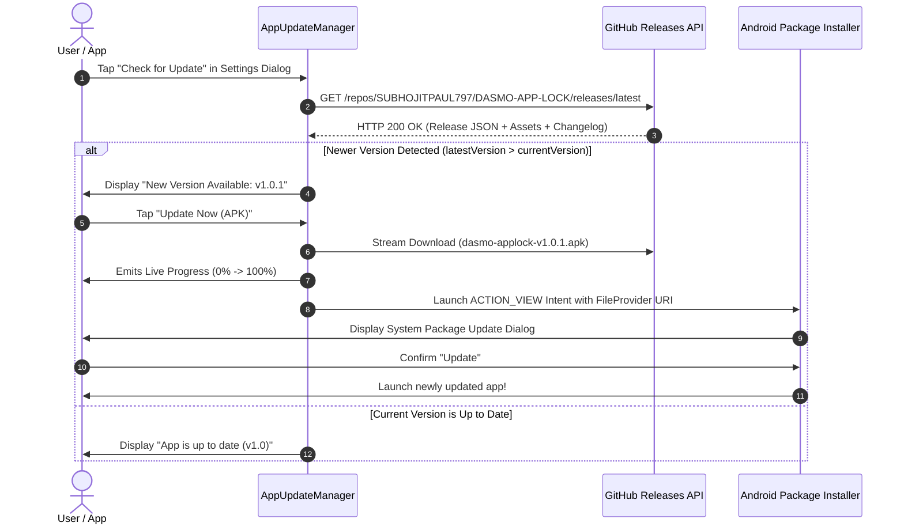

# 🛡️ DASMO LOCK — Production Release & In-App Update Specification

[](https://github.com/SUBHOJITPAUL797/DASMO-APP-LOCK/releases)
[](https://github.com/SUBHOJITPAUL797/DASMO-APP-LOCK)
[-blue?style=for-the-badge&logo=android)](https://developer.android.com)
[-indigo?style=for-the-badge&logo=android)](https://developer.android.com)
[](https://github.com/SUBHOJITPAUL797/DASMO-APP-LOCK)

> **Repository:** [`SUBHOJITPAUL797/DASMO-APP-LOCK`](https://github.com/SUBHOJITPAUL797/DASMO-APP-LOCK)  
> **Application ID:** `dasmo.lock.subhojit`  
> **API Release Manifest:** `https://api.github.com/repos/SUBHOJITPAUL797/DASMO-APP-LOCK/releases/latest`  
> **Distribution Model:** Direct In-App OTA Update via GitHub Releases Engine + Android `FileProvider`  

---

## 📋 GitHub Release Notes (Copy-Paste Ready)

```markdown
# 🛡️ DASMO Lock v1.0.1 — Privacy Guard, AES-256 Vault & In-App Updates

### 🏷️ Metadata
- **Version:** `v1.0.1`
- **versionCode:** `2`
- **Package:** `dasmo.lock.subhojit`
- **Channel:** Production (Stable)
- **Minimum OS:** Android 7.0 (API Level 24)
- **Target OS:** Android 15 (API Level 36)
- **Release Date:** October 2026

---

### 🚀 Highlights & What's New

- **🔄 GitHub-Connected In-App Auto Updates:** 
  The app now connects directly to GitHub Releases (`SUBHOJITPAUL797/DASMO-APP-LOCK`). Users can check for updates, view real-time download progress, and install the new APK directly without leaving the app!
- **🔒 Military-Grade AES-256 Vault:** 
  Hardware-backed keystore encryption for private photos, videos, and documents with instant file shredding.
- **📸 Invisible Intruder Capture:** 
  Silent front-camera snapshot of anyone entering the wrong PIN/pattern, stored securely in the local intruder vault.
- **🧮 Interactive Calculator Disguise:** 
  Camouflage the lock app as a fully functional calculator. Entering your secret PIN followed by `=` unlocks your vault!
- **⚡ Ultra-Fast Lock Screen:** 
  Zero-lag app launch interceptor with fingerprint, biometric face unlock, and scrambled keypad support.

---

### 📦 Artifacts & Downloads

| File | Type | Target Architecture | Size | Checksum (SHA-256) |
| [`dasmo-applock-v1.0.1.apk`](https://github.com/SUBHOJITPAUL797/DASMO-APP-LOCK/releases/download/v1.0.1/dasmo-applock-v1.0.1.apk) | Production APK | Universal (arm64-v8a, armeabi-v7a, x86_64) | 17.8 MB | `6a75e811a2332895b77a7330479b58bc12f3701e1f7f019bb668bfe9d4dcaabd` |


---

### 🛠️ Detailed Changelog

#### 🔄 In-App Updater
- Added `AppUpdateManager` with asynchronous GitHub Releases API integration (`https://api.github.com/repos/SUBHOJITPAUL797/DASMO-APP-LOCK/releases/latest`).
- Live chunked download stream with real-time percentage and downloaded byte metrics.
- Added Settings Dialog "Updates" tab with version check and 1-tap installation.
- Seamless Android `FileProvider` package installer invocation with `REQUEST_INSTALL_PACKAGES` permission support.

#### 🛡️ Privacy & Guard Engine
- Dynamic Time PIN support (PIN matches the current clock time).
- Decoy PIN feature (unlocks a fake, empty vault when forced to unlock).
- Screenshot prevention and Android Recents task blur protection.
```

---

## 🚀 Current Production Release: v1.0.1

### Version Summary
- **Tag:** `v1.0.1`
- **Version Code:** `2`
- **Version Name:** `1.0.1`
- **Status:** General Availability (GA)
- **Repository:** `SUBHOJITPAUL797/DASMO-APP-LOCK`

---

## ⚙️ In-App Update Engine Architecture



---

## 🛠️ Step-by-Step Developer Release Runbook

### Step 1: Bump App Version
In [`app/build.gradle.kts`](file:///c:/CODING/coading/DASMO%20CLIENTS/DASMO-APP-LOCK/app/build.gradle.kts):
```kotlin
  defaultConfig {
    applicationId = "dasmo.lock.subhojit"
    versionCode = 2
    versionName = "1.0.1"
  }
```

### Step 2: Build the Signed Release APK
```bash
./gradlew assembleRelease
```

### Step 3: Compute Checksum & Push Git Tag
```bash
git add .
git commit -m "chore(release): prepare v1.0.1 release"
git push origin main
git tag -a v1.0.1 -m "Release v1.0.1"
git push origin v1.0.1
```

### Step 4: Publish GitHub Release
```bash
gh release create v1.0.1 "app/build/outputs/apk/release/dasmo-applock-v1.0.1.apk" --title "DASMO Lock v1.0.1 — Privacy Guard, AES-256 Vault & In-App Updates" --notes-file RELEASE.md
```
